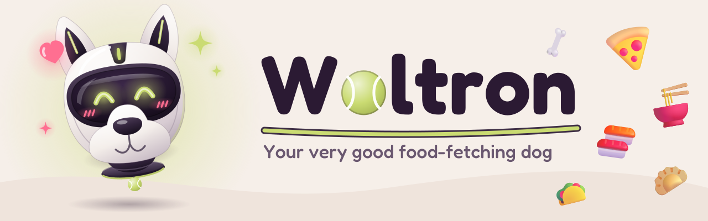
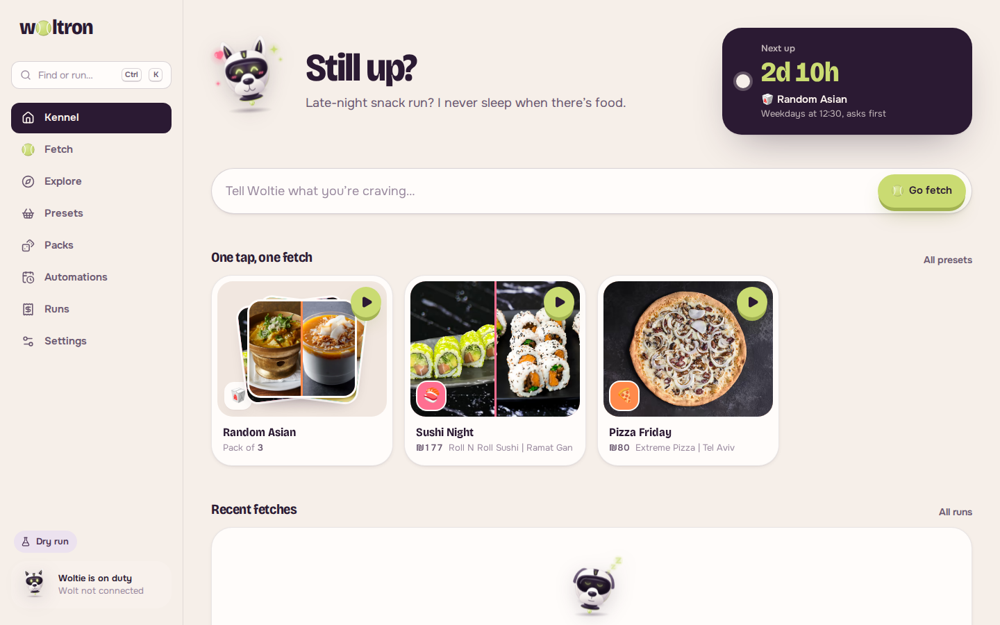
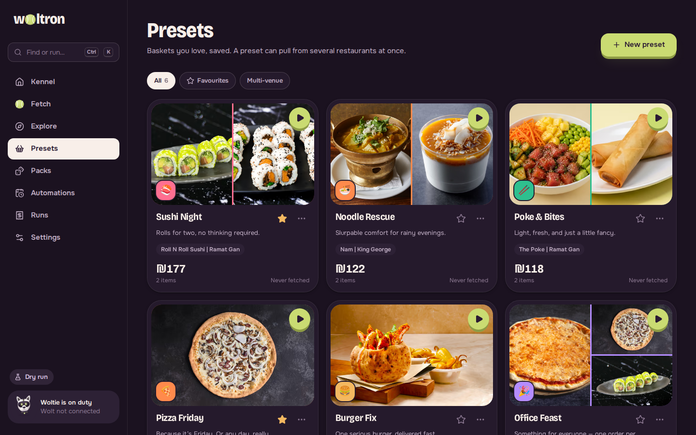
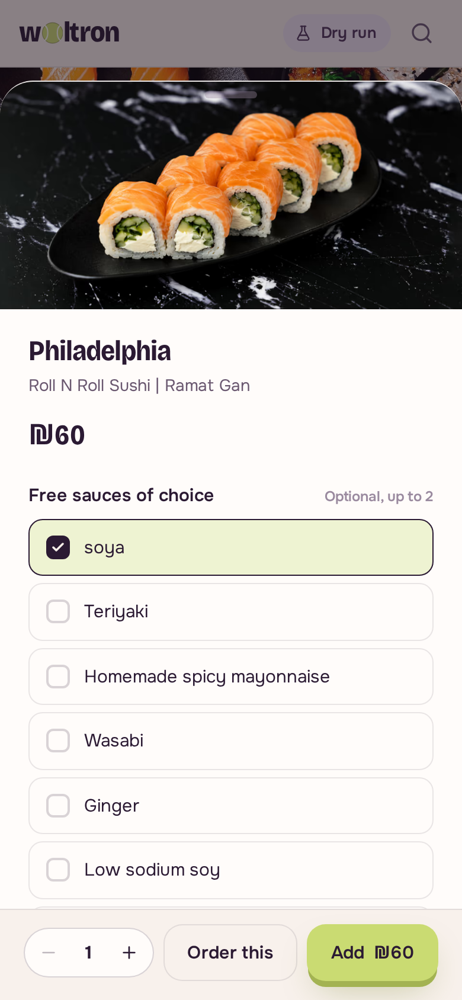
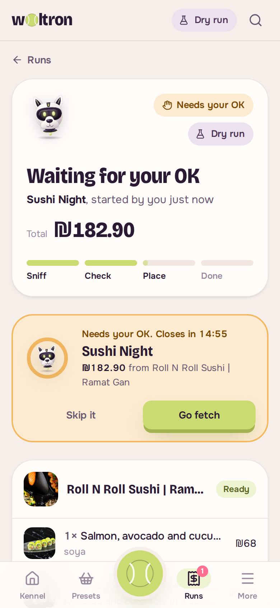

<p align="center">
  
</p>

<p align="center">
  <b>Automate your Wolt orders.</b> Save what you love, bundle it, schedule it, trigger it — or just tell Woltie what you're craving.
</p>

<p align="center">
  
  
  
  
  
  
  
</p>

<p align="center">
  
  
  
  
  
  
  <br><sub>Meet <b>Woltie</b>, the robot dog — idle · happy · sniffing · eating · sleeping · sad</sub>
</p>

---

## ✨ What it does

| | |
|---|---|
| 🍱 **Presets** | Save an exact basket — specific items, options and quantities — from **one or several restaurants**. A multi-venue preset becomes one Wolt order per venue. |
| 🐕 **Packs** | A *superset* of presets, like **"Random Asian"**. Each run picks one preset with a strategy: **shuffle**, **weighted** (1–5 🦴), **round-robin**, or **fresh** (no repeats of the last *N*). |
| ⏰ **Automations** | **Timed** (cron, e.g. *weekdays at 12:30*), **one-off**, **webhook-triggered** (Shortcuts, Home Assistant, IFTTT, curl) or **when a venue comes online**. Auto-place or *ask first* with a confirmation window, plus spend guards. |
| 👆 **Manual** | One tap from the app, ⌘K command palette, the desktop **tray menu**, or a `woltron://` deep link. |
| 🎾 **Fetch** | Free-text food search powered by an LLM via **OpenRouter**: *"something spicy & vegan under ₪60"* → intent → live Wolt search → reranked picks with a one-line *why*. |
| 🖥️📱 **Everywhere** | Electron desktop app with tray + notifications, and a responsive web/PWA you can pair to your phone with a QR code. |
| 🛡️ **Safe by default** | Starts in **dry-run** (full price quote incl. Wolt's real fees, nothing bought). Live mode needs a typed confirmation; per-run and per-day spend caps. |

## 📸 Screenshots

<p align="center">
  
  <br><sub>The Kennel (home) in dark mode — the same UI runs in the Electron app, your browser and your phone</sub>
</p>

<table>
  <tr>
    <td width="50%"><br><sub><b>Kennel</b> — greeting, next automation, one-tap presets & packs</sub></td>
    <td width="50%"><br><sub><b>Fetch</b> — free-text LLM search over live Wolt menus</sub></td>
  </tr>
  <tr>
    <td><br><sub><b>Pack editor</b> — strategy, weights in bones 🦴, spin preview & odds</sub></td>
    <td><br><sub><b>Preset editor</b> — multi-restaurant baskets</sub></td>
  </tr>
  <tr>
    <td><br><sub><b>Automations</b> — schedules, webhooks, venue-online triggers, guards</sub></td>
    <td><br><sub><b>Run detail</b> — per-venue breakdown with Wolt's real fees & live log</sub></td>
  </tr>
  <tr>
    <td><br><sub><b>Explore</b> — venue menus with real Wolt imagery</sub></td>
    <td><br><sub><b>Dark mode</b> — plum, not black</sub></td>
  </tr>
</table>

<p align="center">
  
  
  
  
  <br><sub>On your phone — bottom tabs, a tennis-ball Fetch button, and bottom sheets</sub>
</p>

More in [`docs/screenshots/`](docs/screenshots/).

## 🚀 Quick start

Requires **Node ≥ 22**.

```bash
git clone https://github.com/eternaleclipse/woltron.git
cd woltron
npm install

# Try it with realistic demo data (25 real Tel Aviv venues, no Wolt account needed)
npm run dev:mock          # server on :4321 + web UI on http://localhost:5173

# Real Wolt catalog
npm run dev

# Production: build web + server, then serve everything from :4321
npm run build && npm start

# Desktop app (Electron)
npm run desktop           # add `-- --no-sandbox` on some Linux setups
npm -w @woltron/desktop run dist   # AppImage / deb / dmg / nsis installers
```

### Configuration

| Variable | Default | Purpose |
|---|---|---|
| `OPENROUTER_API_KEY` | — | Enables LLM-powered **Fetch** (or paste a key in Settings). Without it Fetch falls back to keyword search. |
| `WOLTRON_PORT` | `4321` | Server port. |
| `WOLTRON_DATA_DIR` | `~/.woltron` | Where `db.json` and `secrets.json` (mode 0600) live. |
| `WOLTRON_WOLT_MOCK` | off | `1` = use bundled fixture data instead of the live Wolt API. |
| `WOLTRON_SEED` | on | `0` = don't seed demo presets/packs/automations on first run. |
| `WOLTRON_WEB_DIR` | `apps/web/dist` | Where the built UI is served from. |
| `WOLTRON_WOLT_EXPERIMENTAL_PURCHASE` | off | `1` = attempt fully headless purchase (see below). |

### Connecting your Wolt account

1. Log in on [wolt.com](https://wolt.com) in your browser.
2. DevTools → **Application** → Cookies / Local Storage → copy the value of **`__wrtoken`**.
3. Woltron → **Settings → Wolt** → paste it. Woltron refreshes and rotates the token automatically.

Alternatively request a login email on wolt.com and paste the magic link into Settings.

### 📱 Use it from your phone

Settings → **Devices** → enable LAN access and scan the QR code. Remote devices authenticate with a rotatable bearer token embedded in the pairing link; requests from `localhost` are trusted.

### 🪝 Webhook triggers

Every webhook automation gets a secret URL:

```bash
curl -X POST http://<your-host>:4321/api/hooks/<automationId>/<secret>
```

Hook it up to iOS Shortcuts ("Hey Siri, feed me"), Home Assistant, a Stream Deck button, or a cron job elsewhere.

## 🧾 How ordering works

```
target (preset | pack) ─► pick preset (pack strategy) ─► group items by venue
   ─► validate (venue open? items available? current prices & options)
   ─► guards (max per run / per day, venues open, skip dates)
   ─► confirm policy (auto | ask → notification, expires)
   ─► mode: dry-run → "simulated" with Wolt's real fee breakdown
            live    → basket saved to your Wolt account → checkout handoff (one tap to pay)
                      or fully headless purchase when experimental mode is on
```

Wolt has no public ordering API. Woltron uses the **unofficial** endpoints of wolt.com (documented in [`packages/wolt/README.md`](packages/wolt/README.md)). The catalog, search, geocoding and checkout **pricing** endpoints are verified live. Headless purchase is implemented from wolt.com's own client code but needs a saved card + saved address, refuses if the price rises > 2 %, and hands back to you if 3-D Secure is required — so by default, *live* mode builds the basket and opens Wolt's checkout for a one-tap confirm.

> ⚠️ Unofficial API: this may break when Wolt changes things, and automated ordering may be against Wolt's terms. Use responsibly, at your own risk.

## 🏗️ Architecture

```
woltron/
├─ packages/shared   domain types + REST contract + WoltClient interface (single source of truth)
├─ packages/wolt     unofficial Wolt API client (live + mock fixtures)
├─ apps/server       Hono REST + SSE · JSON store · pack strategies · run engine · scheduler · webhooks · LLM Fetch
├─ apps/web          React 19 · Vite · Tailwind v4 · Radix · Motion · TanStack Query · PWA
├─ apps/desktop      Electron: in-process server, tray quick-run, notifications, global shortcut, deep links
└─ assets/           mascot sources, icons, brand
```

The server bundles to a single dependency-free ESM file that Electron imports directly; the same server serves the web UI to your browser and phone. Real-time updates flow over Server-Sent Events.

More docs: [`SPEC.md`](SPEC.md) (product & technical spec) · [`packages/wolt/README.md`](packages/wolt/README.md) (Wolt API notes) · [`apps/desktop/README.md`](apps/desktop/README.md) (desktop bridge) · [`apps/web/DESIGN.md`](apps/web/DESIGN.md) (design system) · [`TODO.md`](TODO.md) (project board)

## 🧪 Development

```bash
npm test            # vitest across workspaces
npm run typecheck
```

## 💛 Credits

Woltie is an original robot dog drawn in code (`assets/scripts/robodog.py`), with six LED-eye expressions; banner food stickers are Microsoft's [Fluent Emoji](https://github.com/microsoft/fluentui-emoji) (MIT); wordmark in Fredoka (OFL). Full list in [`CREDITS.md`](CREDITS.md). Not affiliated with Wolt or DoorDash.
