

  <picture>
    <source media="(prefers-color-scheme: dark)" srcset="../assets/brand/logo-dark.svg">
    
  </picture>

# Screenshots

← [Back to the README](../README.md) · [Documentation](README.md)

## Desktop

The gallery follows your GitHub theme. Switch GitHub to dark to see every screen in Woltron's dark mode, or scroll down.

<table>
  <tr>
    <td width="50%"><picture><source media="(prefers-color-scheme: dark)" srcset="screenshots/fetch-desktop-dark.png">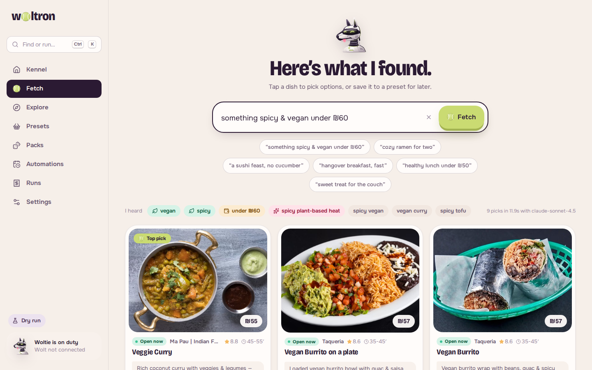</picture> <b>Fetch</b>: plain-language search over live menus</td>
    <td width="50%"><picture><source media="(prefers-color-scheme: dark)" srcset="screenshots/pack-editor-desktop-dark.png">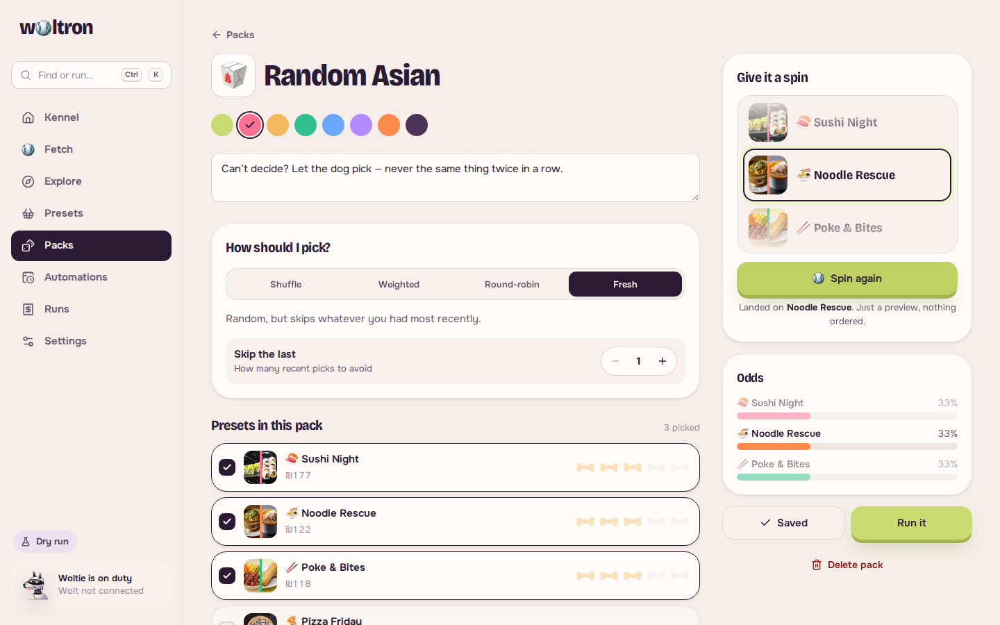</picture> <b>Packs</b>: strategy, weights, odds and a spin preview</td>
  </tr>
  <tr>
    <td width="50%"><picture><source media="(prefers-color-scheme: dark)" srcset="screenshots/automation-editor-desktop-dark.png">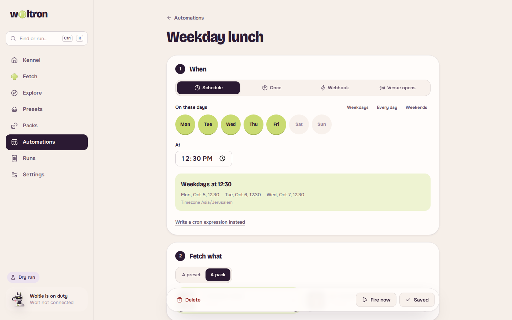</picture> <b>Automations</b>: schedules, webhooks, guards</td>
    <td width="50%"><picture><source media="(prefers-color-scheme: dark)" srcset="screenshots/run-detail-desktop-dark.png">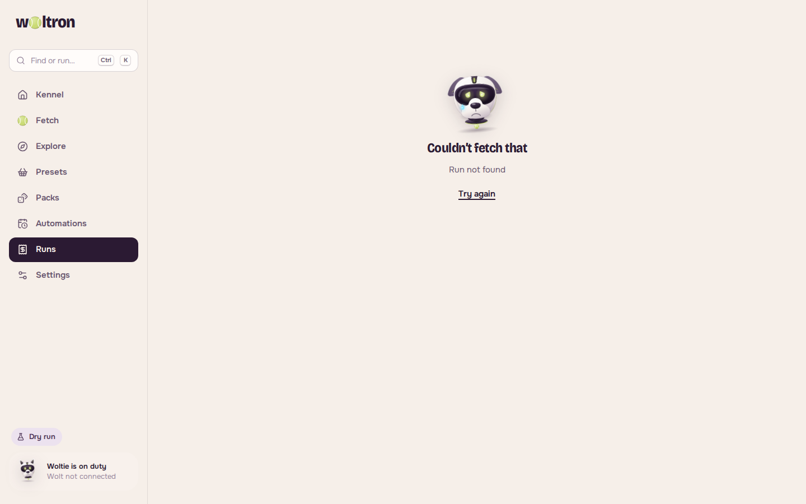</picture> <b>Runs</b>: per-venue breakdown and a live log</td>
  </tr>
  <tr>
    <td width="50%"><picture><source media="(prefers-color-scheme: dark)" srcset="screenshots/preset-editor-desktop-dark.png">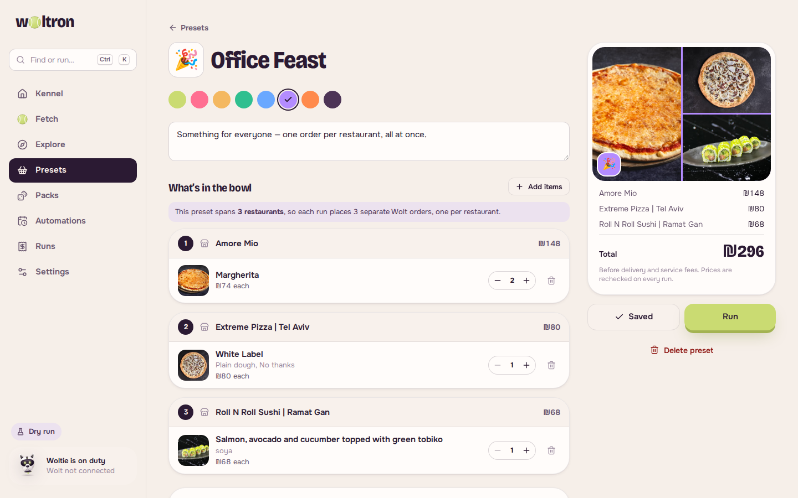</picture> <b>Presets</b>: multi-restaurant baskets</td>
    <td width="50%"><picture><source media="(prefers-color-scheme: dark)" srcset="screenshots/venue-desktop-dark.png">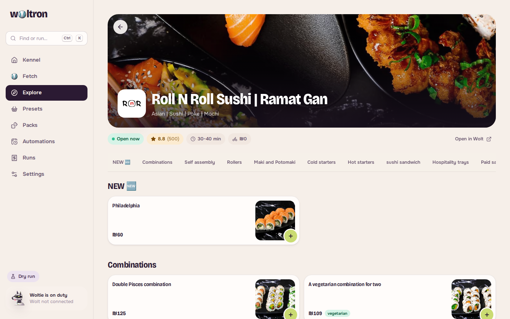</picture> <b>Explore</b>: real menus and photos from Wolt</td>
  </tr>
</table>

  <picture><source media="(prefers-color-scheme: dark)" srcset="screenshots/home-mobile-dark.png">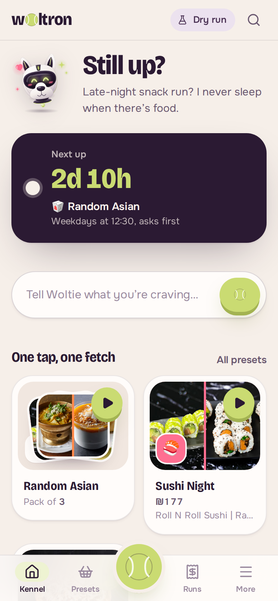</picture> <picture><source media="(prefers-color-scheme: dark)" srcset="screenshots/fetch-mobile-dark.png">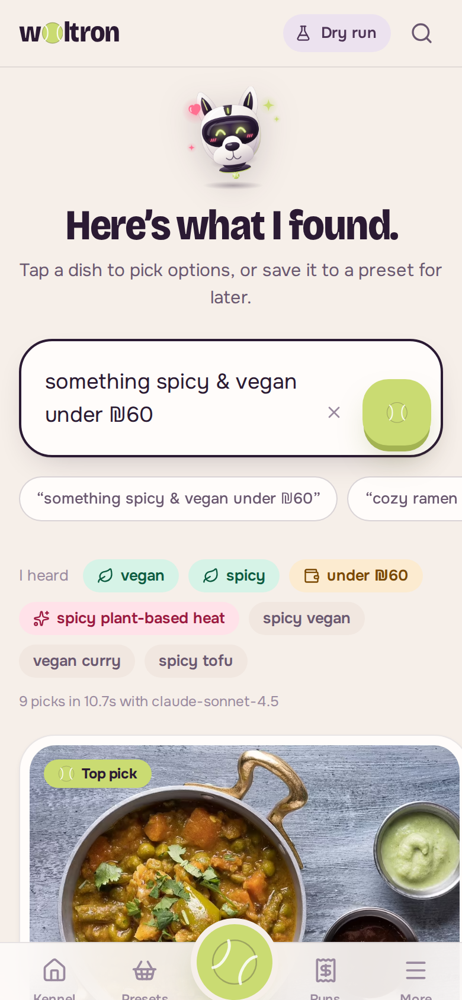</picture> <picture><source media="(prefers-color-scheme: dark)" srcset="screenshots/explore-mobile-dark.png">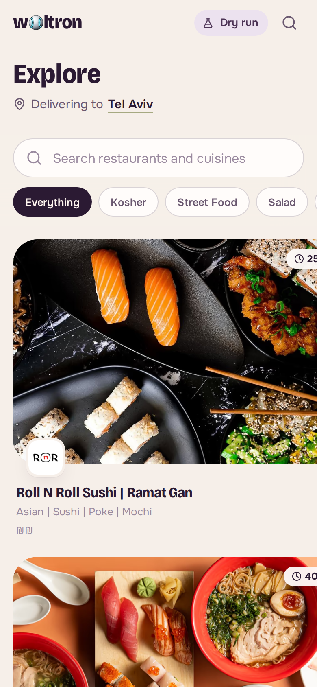</picture> <picture><source media="(prefers-color-scheme: dark)" srcset="screenshots/run-detail-mobile-dark.png">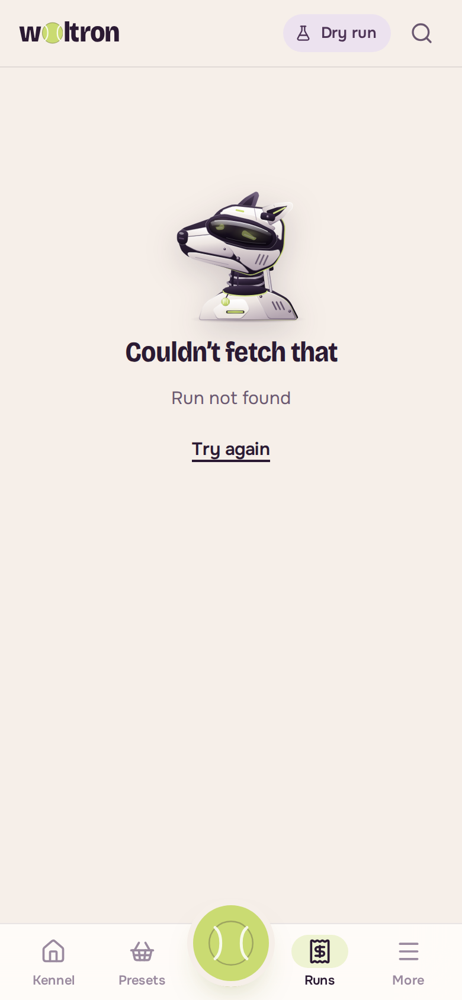</picture>
   On your phone

## 🌙 Dark mode

Plum, not black. Every screen ships in both themes and follows your system setting (or pick one in **Settings → Look & feel**).

<table>
  <tr>
    <td width="50%">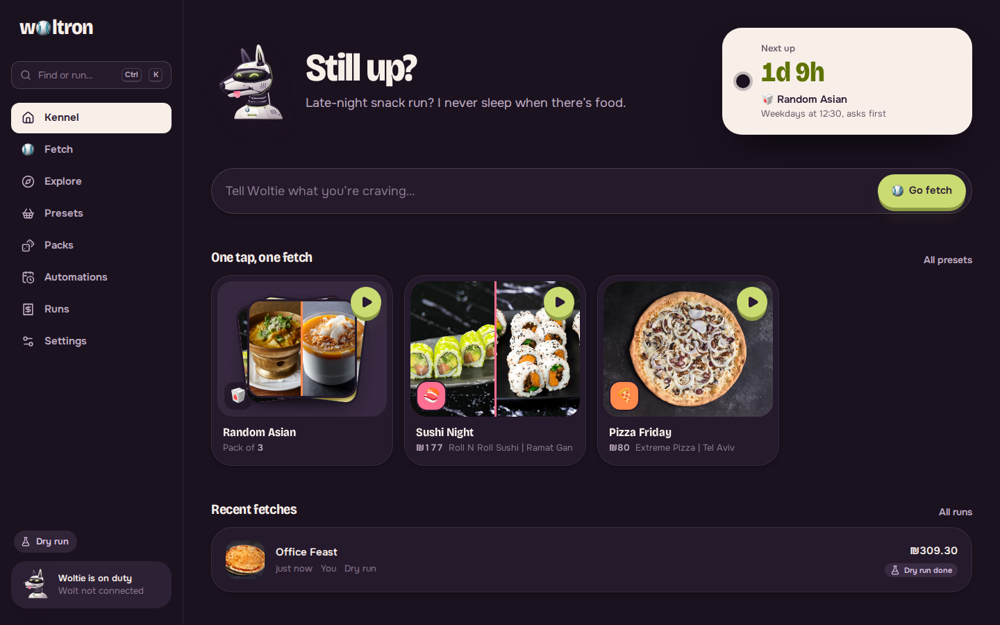</td>
    <td width="50%">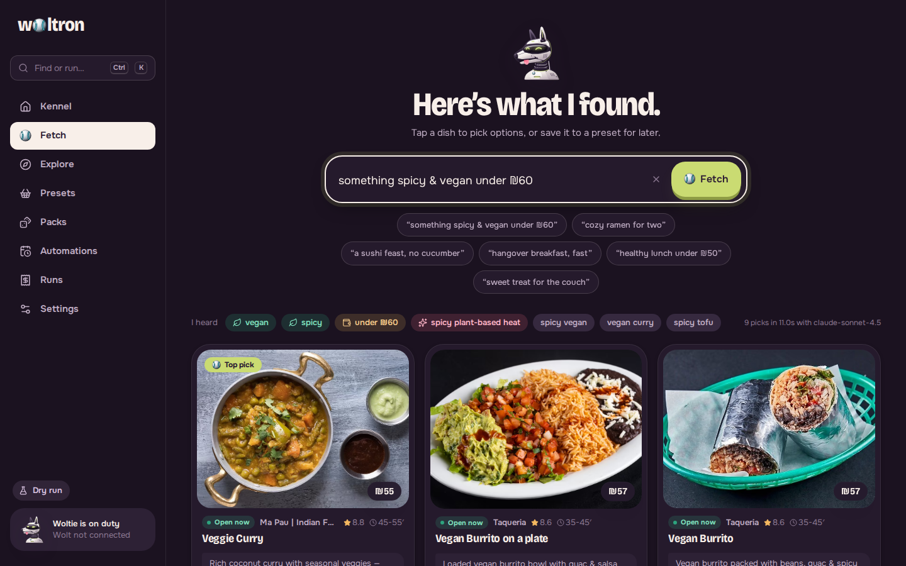</td>
  </tr>
  <tr>
    <td>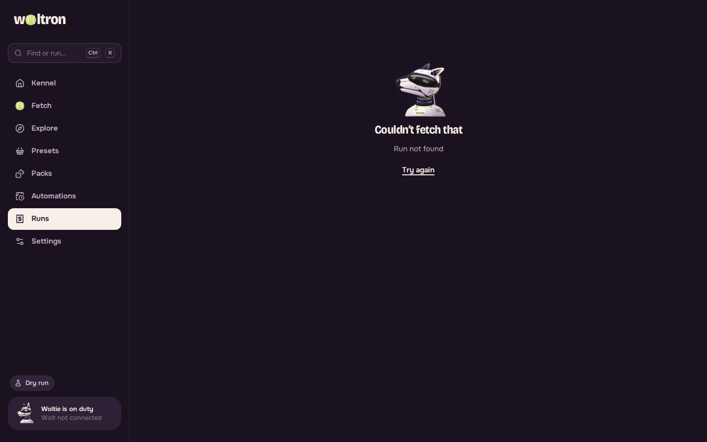</td>
    <td>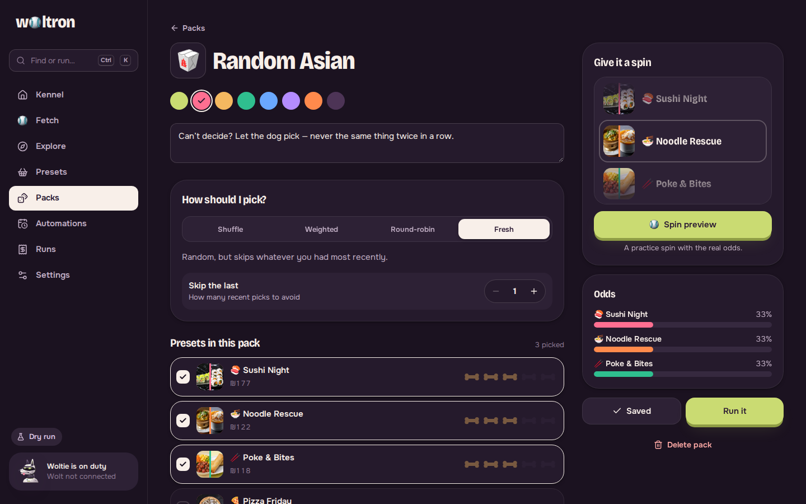</td>
  </tr>
</table>

  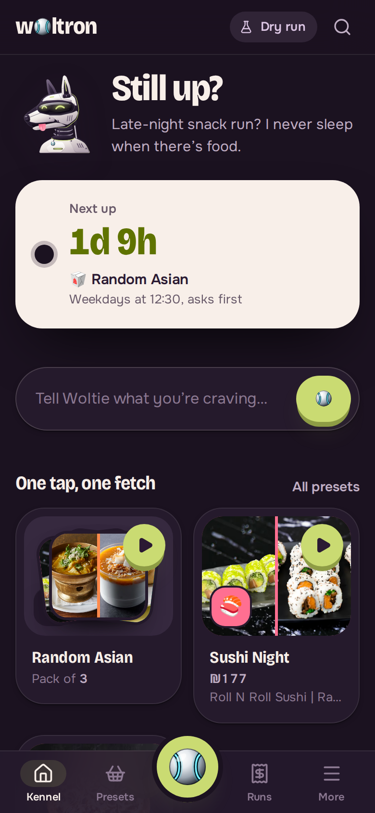
  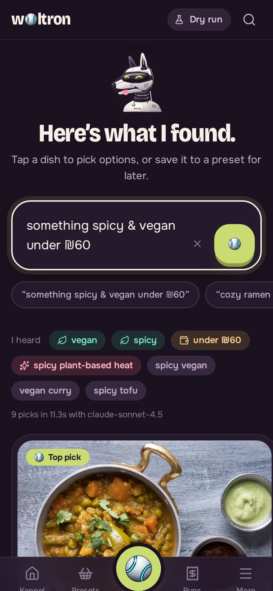
  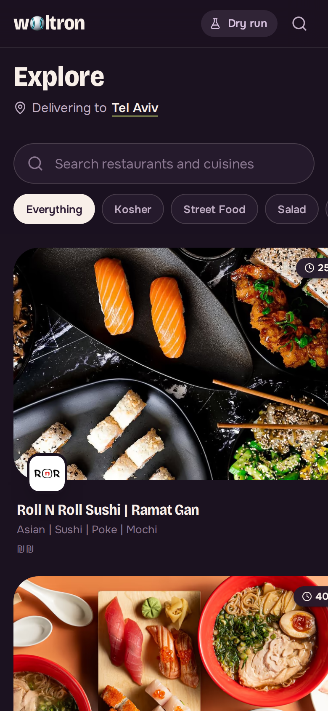
  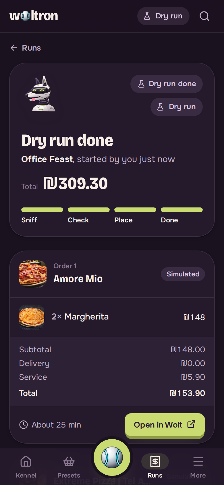

More in [`screenshots/`](screenshots/). Regenerate them with the scripts in [Development](development.md#screenshots).
